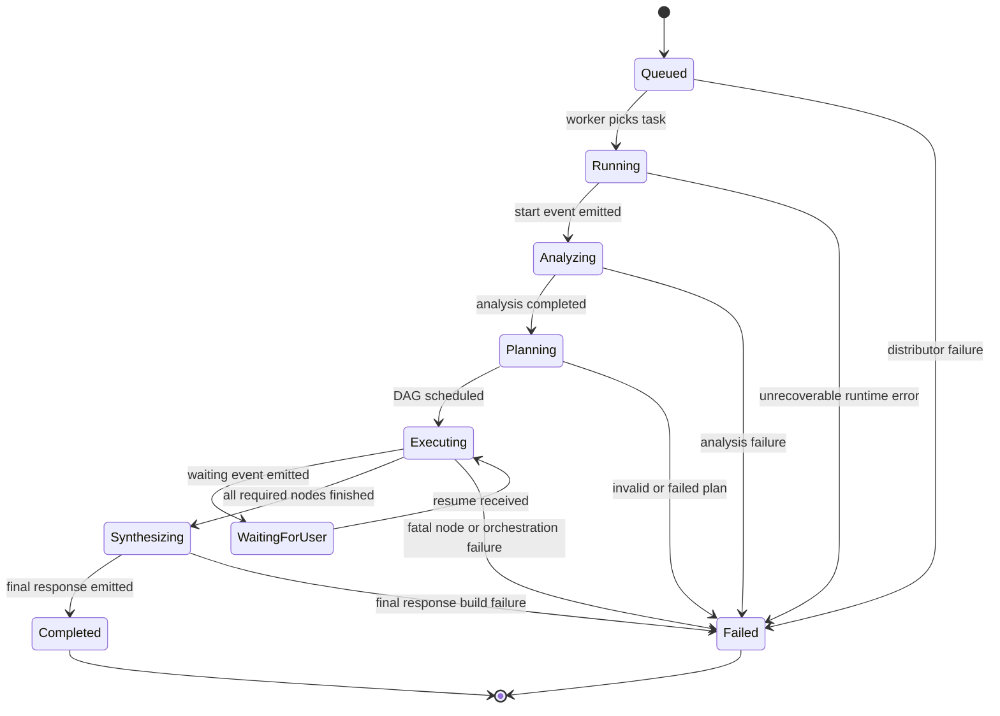
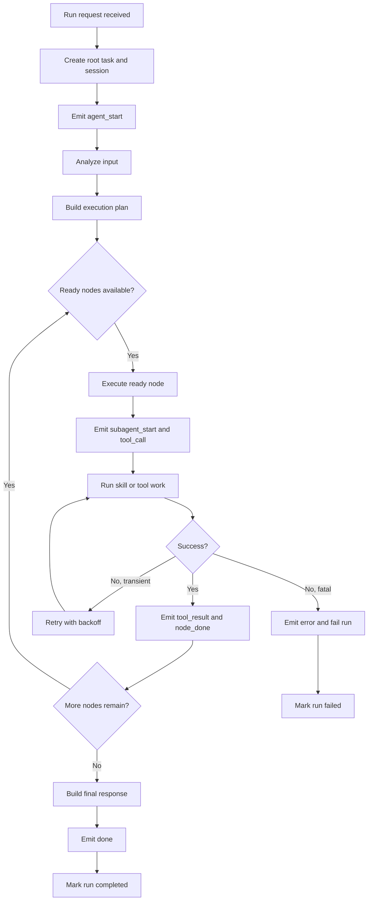

# Agent Execution Flow

## Overview

This document describes how one agent request moves through the internal execution pipeline.
It focuses on states, transitions, orchestration, and failure behavior.

The system uses an internal task distributor to assign queued runs to workers.

The execution model has one root coordinator per user turn.
That coordinator analyzes the input, plans work, schedules nodes, emits trace events, and produces a final response.

The system is event-first.
Execution progress is visible because each major transition becomes a trace event.

This execution model is similar to a task scheduler.
It is scoped to a single user request.
It is optimized for observability.

## Execution Lifecycle

### 1. Request accepted

The backend receives a validated run request with:

- prompt
- session id
- message id

The request is turned into a queued root task.

### 2. Run context initialized

When a worker begins execution, the run service creates or updates:

- session state
- root task state
- repository records for streamed events

The run then emits an initial `agent_start` event.

### 3. Input is analyzed

The orchestrator inspects the prompt and builds an analysis result.
This step determines execution inputs such as:

- normalized prompt
- intent
- keywords
- execution mode
- response language

This phase emits `thinking` events.

### 4. Planning phase builds an execution graph

The planner transforms the analysis result into a DAG of nodes.
Each node represents one unit of skill work.

The plan may remain mostly linear.
It may also be rewritten into a more parallel structure when the orchestration logic decides that parallel execution is useful.

Planning emits:

- `thinking`
- `artifact_created`
- `node_start` for scheduled nodes

### 5. Nodes enter execution

The executor selects nodes whose dependencies are already complete.
It does not run blocked nodes.
It can run multiple ready nodes at once within the configured concurrency limit.

For each executed node, the orchestrator emits a visible execution envelope:

1. `subagent_start`
2. `tool_call`
3. one or more `thinking` progress events
4. `tool_result`
5. `node_done`
6. `subagent_done`
7. optional `artifact_updated`

This lets the UI show node execution as collaborative sub-agent activity.

### 6. Results accumulate in working memory

Each completed node contributes:

- a success or failure outcome
- execution metadata
- optional evidence artifacts
- memory entries used by later reasoning

The runtime stores enough information to synthesize a final answer after node execution ends.
The working memory is scoped to a single run.
It stores intermediate results and artifacts used for final synthesis.

### 7. Final response is built

After all required nodes are complete, the final response builder creates the assistant output.
The run service then emits the terminal `done` SSE event.

The root task is marked completed and the session is marked done.

## Event Streaming Integration

All execution events are streamed to the client through SSE.

- events are emitted as state transitions occur
- the stream stays open during the run
- the stream closes on terminal `done` or `error`
- the frontend builds the trace view incrementally from the stream

This makes execution observable in real time.
The user does not need to wait for the full run to finish.

## SDK Role in Execution

The SDK defines the abstractions used by the runtime layer.

- **Agent**: reasoning and orchestration entry points
- **Tool**: external capabilities wrapped behind stable interfaces
- **Runtime**: execution lifecycle and event transport abstractions

These abstractions keep execution modular.
They also make the system easier to extend without changing the external request model.

## Agent State Machine

## Sub-agent Orchestration Model

### Root coordinator

Each user message creates one root coordinator flow.
This coordinator owns:

- input analysis
- plan construction
- scheduling decisions
- final response assembly

### Sub-agent view

The UI exposes node execution as sub-agent activity.
This is a presentation of internal orchestration, not a separate external process model.

In practice, one planned node is wrapped with:

- start event
- call/result events
- done event

This gives a readable sub-agent narrative without changing the underlying DAG executor model.

### Parallel branches

When the plan contains independent nodes, the executor can run them concurrently.
The coordinator waits for dependency completion before releasing downstream nodes.

This creates three useful properties:

- safe dependency ordering
- bounded concurrency
- visible branch progress in the trace

## Error Handling and Retries

### Root-level failure handling

If the root run fails, the run service:

- marks the task failed
- marks the session failed
- emits an `error` SSE event
- closes the stream

### Node-level retry behavior

The executor retries transient node failures.
It uses backoff between attempts.
It stops retrying when:

- retry budget is exhausted
- the error is classified as permanent

### Timeout handling

Node execution has a timeout limit.
Timed out nodes are treated as failed attempts.

### Circuit breaking and caching

The executor includes:

- per-skill circuit breakers
- node result caching

Circuit breaking limits repeated failures against unstable dependencies.
Caching avoids recomputing identical node work.

### Queue-level failure handling

If no task handler exists for a queued task prefix, the distributor emits an error to the run event queue and closes the stream.

### Waiting and resume

If the runtime emits a `waiting` event, the root task moves to a waiting state.
The system stores the waiting prompt in the repository.
Execution resumes when the user responds through the resume path.

## Execution Flow Diagram

## Limitations

- The trace explains execution flow, not factual correctness.
- SSE is one-way. It is good for streaming output, but not for rich bidirectional control.
- Root request distribution is queue-based inside the service process. It is not a distributed job system.
- Sub-agent activity is modeled through orchestration events around DAG nodes. It is not a fully independent actor system.
- Final answer quality still depends on provider behavior, tool quality, and planner decisions.