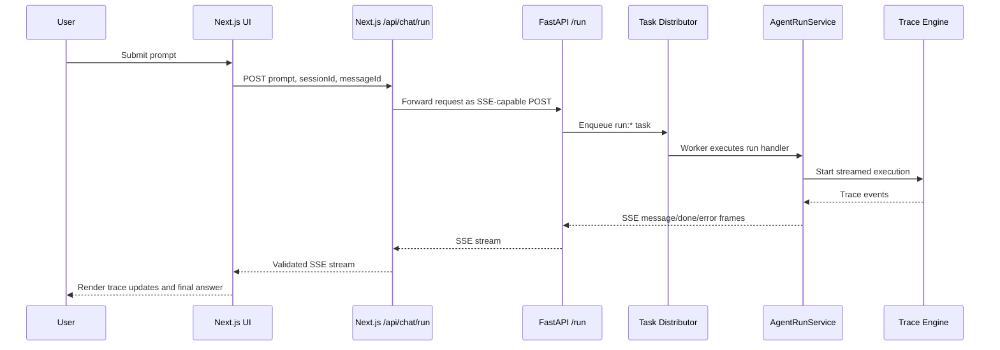

# Pipeline Architecture

## Overview

This document describes the end-to-end runtime pipeline of Glass Box Chat.
It focuses on data flow, event transport, orchestration, and trace rendering.

The system treats each user request as an isolated execution pipeline.
It behaves like a request-scoped distributed system.
Each user message triggers a fully observable path from input to final response.

The system is event-driven.
Each important runtime step becomes a typed event.
Those events are streamed to the frontend over SSE.
The frontend then reconstructs a readable execution trace from that stream.

The Trace Engine is the concrete implementation of the agent orchestrator.
It is responsible for producing the runtime events consumed by the rest of the pipeline.

At a high level, the pipeline has five layers:

1. UI input and local state
2. Frontend API proxy and stream validation
3. Backend request intake and task distribution
4. Agent runtime and execution engine
5. Streaming response and trace rendering

## End-to-End Flow

### Step 1. User input starts in the UI

The user submits a prompt from the chat interface.
The frontend runtime creates or reuses a `sessionId` and creates a `messageId` for the new turn.

### Step 2. Frontend sends one request per user turn

The frontend posts the request to the internal Next.js route at `/api/chat/run`.
That request contains:

- the prompt
- the session identifier
- the message identifier

This keeps one streamed run aligned to one user message.

### Step 3. Next.js acts as a streaming proxy

The internal route forwards the request to the Python backend `/run` endpoint.
It sets `Accept: text/event-stream` and expects SSE in return.

The route does not generate runtime events itself.
Its job is to:

- validate request shape
- forward the request to the backend
- validate upstream SSE payloads by event type
- forward a clean SSE stream to the browser

This creates a stable boundary between browser code and the runtime backend.
It also creates a strict contract boundary between untrusted browser input and the internal runtime event system.

### Step 4. Backend accepts the run and enqueues work

The backend `/run` endpoint does not execute the agent inline.
It creates a task id with the `run:` prefix and places the work into a FIFO task distributor.

The payload passed into the distributor includes:

- prompt
- session id
- message id
- an async event queue used for streaming

This decouples HTTP request intake from runtime execution.
It also enables controlled concurrency at the run level.

### Step 5. A worker picks up the run task

Task distributor workers resolve the handler by task id prefix.
For `run:*` tasks, the worker invokes the run handler, which calls `AgentRunService.stream_run_agent(...)`.

This is the main orchestration boundary for one user turn.

### Step 6. AgentRunService initializes execution context

The run service creates and updates runtime records for:

- session
- root task
- task state transitions

It emits an initial `agent_start` event and persists streamed events into the runtime repository.

### Step 7. Trace engine produces runtime events

The run service delegates actual trace generation to a trace engine implementation.
In normal operation this is the orchestrator engine.
If no provider key is configured, the system can fall back to a mock engine.

The engine emits events such as:

- `thinking`
- `agent_start`
- `node_start`
- `tool_call`
- `tool_result`
- `subagent_start`
- `subagent_done`
- `node_done`
- `artifact_created`
- `artifact_updated`
- `waiting`

Each event includes session and message scope, branch, mode, timestamp, and optional metadata.

### Step 8. Runtime events become SSE frames

The backend converts each event payload into SSE frames.
There are three logical SSE event types:

- `message` for trace events
- `done` for the final assistant response payload
- `error` for terminal failure messages

The Python backend yields these frames through `EventSourceResponse`.

### Step 9. Frontend consumes the SSE stream

The browser reads the response body as a stream.
The frontend SSE consumer parses `event:` and `data:` lines, reconstructs full events, and routes them by type.

- `message` updates trace state
- `done` appends the assistant response
- `error` fails the current turn

### Step 10. UI reconstructs a readable runtime trace

The frontend does not render backend output as raw text.
It groups events by session and message and renders a structured trace panel.

This gives the user a readable view of:

- reasoning steps
- tool activity
- sub-agent progress
- branch execution
- final completion state

## Sequence Diagram

## Event Streaming Model (SSE)

### Why SSE is used

The pipeline needs one-way, server-to-client streaming.
The browser submits one request and then waits for incremental updates.

SSE matches that model well:

- simple transport
- plain HTTP
- easy proxying through the Next.js route
- natural fit for ordered event delivery

SSE also has clear limits.
It is not designed for rich bidirectional communication.
Interactive control flows such as cancel, live parameter mutation, or dynamic tool injection need separate channels.

### SSE event contract

The stream is divided into logical event types.

| SSE Event | Purpose |
|---|---|
| `message` | One validated trace event |
| `done` | Final assistant payload |
| `error` | Terminal error payload |

The Next.js proxy validates upstream payloads before forwarding them to the browser.
This prevents malformed runtime output from leaking directly into UI state.

### Transport semantics

The backend writes one SSE frame at a time.
The frontend consumer buffers partial chunks until a blank line closes the frame.
This allows the UI to process streamed events incrementally without waiting for the run to finish.

## Agent Runtime and Task Distribution

### Runtime layers

The execution path inside the backend is intentionally layered:

1. `TaskDistributor` accepts queued work
2. `AgentRunService` manages one root run
3. `TraceEngineProtocol` implementation generates runtime events
4. `DAGExecutor` schedules and executes planned nodes

### Single-agent vs sub-agent execution

At the API level, one user request starts one root run.
Inside that run, the orchestrator may still split work into many planned nodes.

Two execution patterns are supported:

- **Single-path execution**: one main reasoning path with ordered dependencies
- **Multi-branch execution**: planner-produced DAG with parallel-ready branches and sub-agent style progress events

The orchestrator emits `subagent_start` and `subagent_done` around node execution so the UI can visualize work as collaborating agents, even though the backend schedules concrete DAG nodes.

### Dependency-aware scheduling

The executor does not run all nodes at once.
It selects nodes whose dependencies are complete.
Ready nodes are prioritized and can run concurrently up to the configured limit.

This gives the runtime:

- deterministic dependency handling
- bounded parallelism
- support for sequential and parallel plans

### Queue-based request isolation

The outer task distributor isolates HTTP intake from execution.
The inner DAG executor isolates planning from node scheduling.

This split is important:

- a request can start streaming without running heavy logic in the HTTP handler
- queue depth and worker health can be measured independently
- root-level concurrency and node-level concurrency are controlled separately

### Role of the SDK and shared packages

The project separates concerns across shared packages:

- `@glassbox/sdk`: abstraction boundary for skills, provider integrations, and agent-oriented execution components
- `@glassbox/runtime`: runtime event bus abstraction for event transport inside shared runtime code
- `@glassbox/types`: stable contracts for trace events, assistant payloads, and validation schemas

Conceptually, the SDK layer defines how agent-like components and tools integrate with the runtime.
The runtime layer transports events.
The types layer keeps frontend and backend aligned on the same event contract.

## Trace Reconstruction in UI

### Input to the UI

The UI receives a flat sequence of validated runtime events.
Each event carries enough context to be grouped and ordered:

- `sessionId`
- `messageId`
- `createdAt`
- `branch`
- `mode`
- metadata and optional artifacts

### Reconstruction model

The frontend reconstructs trace state in stages:

1. append incoming events to the active session
2. group events by message
3. separate important events from supporting events
4. render visible windows for performance
5. show final assistant output when `done` arrives

This means the UI acts as a trace interpreter, not only a log viewer.
The UI applies windowing so it does not render the full event history at once.
This keeps the interface responsive for longer traces.

### Why trace reconstruction matters

The runtime emits facts in event form.
The UI turns those facts into a user-facing explanation of execution.

That translation is the core value of the system.

## Event Lifecycle Diagram

```mermaid
flowchart LR
    A[Runtime step occurs] --> B[Trace event payload created]
    B --> C[Persist event in repository]
    C --> D[Wrap as SSE message frame]
    D --> E[Stream through FastAPI EventSourceResponse]
    E --> F[Validate in Next.js proxy]
    F --> G[Consume in browser stream parser]
    G --> H[Append to trace state]
    H --> I[Group by session and message]
    I --> J[Render trace panel]
```

## Key Design Decisions

### Event-driven architecture

The runtime emits state changes as events instead of hiding execution inside opaque service calls.
This makes the pipeline observable and replay-friendly.

### SSE instead of WebSocket

The main transport is server to client.
SSE keeps the streaming path simple and easy to proxy.

### Queue before execution

The backend enqueues root work before running it.
This keeps HTTP handlers thin and gives better control over worker concurrency.

### DAG execution inside one run

A user message maps to one root run, but that run can expand into many dependent nodes.
This allows both simple and advanced workflows without changing the external API.

### Shared event contract

The frontend proxy, browser consumer, and backend runtime all rely on the same trace event contract.
This reduces mismatch between transport, validation, and rendering.

This architecture also enables future extensions.
Examples include persistent trace storage, replay tooling, and distributed execution beyond a single service process.